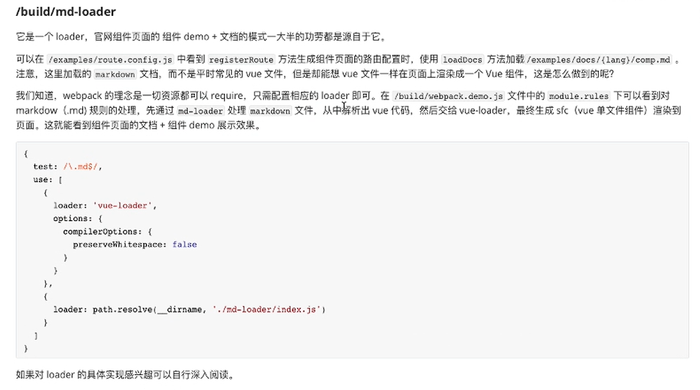

如何快速为团队打造自己的组件库？

# element-ui 源码架构：

1. 进入社区的能力，裁剪一个优秀的开源库，保留需要的东西（比如：架构、工程化、文档整理、部分技术组件）

2. element-ui 框架源码：工程化、官网、组件库、测试、类型声明 组成
    - 工程化：大量的脚本、开发者专注事情的本身、（比如添加组件可以一键式生成所有文件并完成文件基本结构的编写和相关配置。通过 eslint 做代码的管理、travel-ci 只能用于 GitHub， 结合 share 脚本做持续集成的、Makefile 封装命名提高开发体验、package.json 通过 scripts 提供了大量的命令配合 build 中定义的脚本，自动化程度更高

    - 工程化做了哪些事情？

      1. build 中的脚本占了很大的作用，build 目录中存放工程化配置和脚本。
      2. md-loader 官网组件页面中能根据 markdown 生成组件页面。
      3. 控制台输入 node build/bin/build-locale.js 在 lib 目录下会生成一个 umd/locale/ 文件夹里面放 打包好的 js 文件（其实就是将 build/bin/build-locale.js 转义 umd 风格的）。
      4. 将 src 目录下的 入口文件 index.js 删掉，执行 node build/bin/build-entry.js 重新生成 index.js 文件。
      5. 当我们有了 build/bin/gen-cssfile.js 文件，删除 packages/theme-chalk/src/index.scss 文件，执行 node build/bin/gen-cssfile.js 命令，会自动生成 packages/theme-chalk/src/index.scss 文件。
      6. examples/pages/ 目录下的 都是通过 examples/pages/template 目录自动生成各种 Vue 语言模板的包和官网翻译。
      7. 执行 node build/bin/i18n.js 命令自动生成 examples/pages/ 目录下的各种语言包。
      8. 执行 node build/bin/iconInit.js 命令 在 examples/ 目录下自动生成 icon.json 文件。
      9. examples 目录属于官网项目，而 icon.json 会在 examples/entry.js 引入，然后将 icon 挂载到 vue 原型链上，在 examples/docs/zh-CN/icon.md 文件通过 md-loader 解析，最后 vue-loader 生成一个可以渲染的文件组件，会发现 build/webpack.demo.js 入口文件里面也有写到。
      10. build/bin/new-lang.js 文件的作用，比如添加法语，使用 make new-lang fr 命令，会有四个文件被改动，分别添加法语的配置，组件页面的则边栏导航。
      11. build/bin/new.js 文件非常重要，比如：当使用 make new el-city 城市列表 命令，会构建设计 13 个文件，分别配置到 components.json…… 。
      12. build/bin/template.js 文件去监听 examples/pages/template 目录下的所有模版文件，当模版文件发生改变时自动执行 npm run i18n。
      13. build/bin/version.js 文件在导航栏 “版本号” 那里起作用，examples/versions.json 文件记录版本信息
      14. 组件页面、文档模式、实例代码都是源于它 build/md-loader，通过解析最后交给 vue-loader。

          > 
      15. build/config.js 文件做的事情简单但是很重要，其缺陷也很明显。
  
3. /build 目录 讲解顺序
    - build/bin/build-entry.js
    - build/bin/build-locale.js
    - build/bin/gen-cssfile.js
    - build/bin/i18n.js
    - build/bin/iconInit.js
    - build/bin/new-lang.js
    - build/bin/new.js
    - build/bin/template.js
    - build/bin/version.js
    - build/md-loader
    - build/config.js
    - ……

建议：
  1. 不要从 0 构建，回花费大量的时间，在开源库的基础上做
  2. 配置/examples/route.config.js + 目录/examples/nav.config.json 约定去自动化生成路由配置的
